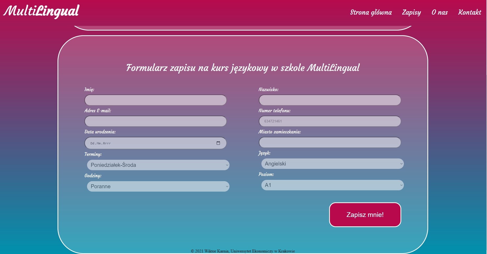

<!-- PROJECT LOGO -->
<br />
<p align="center">
  <a href="https://github.com/WiktorKarnia/MultiLingual">
    
  </a>

  <h3 align="center">MultiLingual Page</h3>

  <p align="center">
    A sample website for an online language school.
    <br />
    <a href="https://github.com/WiktorKarnia/MultiLingual"><strong>Explore the docs »</strong></a>
    <br />
  </p>
</p>

<!-- ABOUT THE PROJECT -->
## About The Project

It's a sample website with database functionality that allows you to sing up for language courses. It's an HTML site customed visualy with CSS and also has some PHP functionality thanks to which the whole "sign up" thing works.  
<p align="center">
  <a href="http://v-ie.uek.krakow.pl/~s215117/ProjektPPIV/index.htm">
    
  </a>
</p>
## Getting Started

To get a local copy up and running follow these simple steps.

### Installation

1. To look into the code clone the repo
   ```
   git clone https://github.com/WiktorKarnia/MultiLingual
 
 1. To see the site and functionality
    ```
    http://v-ie.uek.krakow.pl/~s215117/ProjektPPIV/index.htm


<!-- CONTACT -->
## Contact

Email - wiktorkarnia@gmail.com

Project Link: [https://github.com/WiktorKarnia/MultiLingual](https://github.com/WiktorKarnia/MultiLingual)


